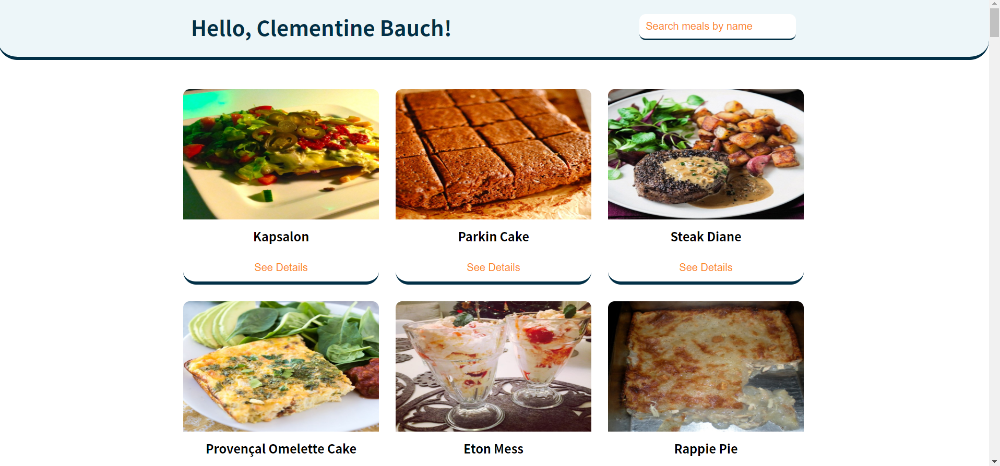
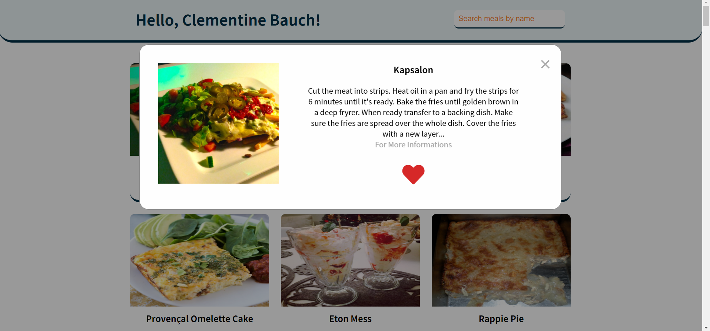
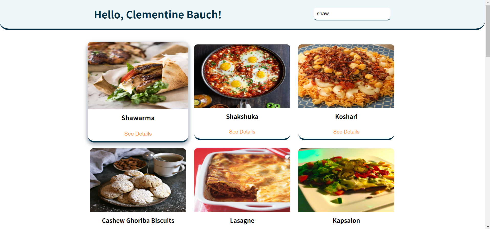

# Food Search App

<a href="https://food-search-engine.netlify.app/" target="_blank">Live</a>

# 🧰 Toolbox

<ul style="list-style-type:disc">
   <li><a href="https://parceljs.org/" target="_blank">Parcel</a></li>
   <li><a href="https://fusejs.io/" target="_blank">Fuse.js</a></li>
   <li><a href="https://airtable.com/shrZzp5NeTTHthGvH" target="_blank">Airtable API</a></li>
</ul>

# 🎞 Screenshot

### ODEV ONCESI
Eğer bu repoyu kullanarak kendi bilgisayarinizda development yapmak isterseniz sirasiyla,
1) Repoyu clonelayin
2) yarn veya npm install komutunu calistirin (Sadece birisi)
3) yarn start veya npm start komutunu calistirin (sadece birisi)

index.js'e ve index.html'e kod yazarak baslayabilirsiniz. yarn start yaptiysaniz degisiklikleriniz otomatik olarak ekranda gorulmeli. Sorun yasarsaniz asistanlari bulun.

Eger bu repoyu kullanmadan (parcel olmadan) kullanmak istiyorsaniz;

1) Codesandbox.com 'u kullanabilirsiniz
2) direk index.html'e yazarak calistirabilirsiniz.

ODEV

----- 
### Yemek Arama Motoru

Bir yemek arama moturu yapmakla sorumlusunuz, ana ekranda sadece bir arama kutusu ve login olan kullanicinin adı olacak. 
Kullanici veri girdikce bir arama yapacaksiniz ve cikan sonuclari listeleyeceksiniz.
Cikan sonuclar bir kartta listelenir. Kartın uzerine tıkladığınizda o karta odaklanacak. (Border olabilir ,ekranın ortasına gelebilir.). Kartta favorilere ekle butonu vardır. Kart açıkkan F tuşu ile ya da butona basarak favoriye/ekle çıkar işlemi gerçekleştirilebilir. Browser'i kapatip actiktan sonra da favorilerim kalmaya devam etmeli.

- Login olan kullanıcı bilgileri endpoint: https://jsonplaceholder.typicode.com/users/1
- Tüm yemek listesi endpoint: https://jsonplaceholder.typicode.com/todos (title, yemek adı olsun)
- Uygulama açıldığında kullanıcı bilgileri ve yemek listesi yüklenecek. Bu iki yükleme olurken ekranda loading  çıkacak.
- Login olan kullanıci bilgisi arama kutusunun ustunde Merhaba, {name} seklinde yazacak.
+ Arama yaparken fuse.js kullanmayı deneyin
+ Ard arda arama yaparken olabildiğince performanslı yazmayı deneyin. (Neler yapılabilir?)
