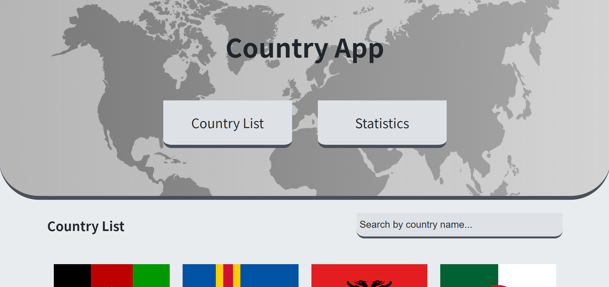
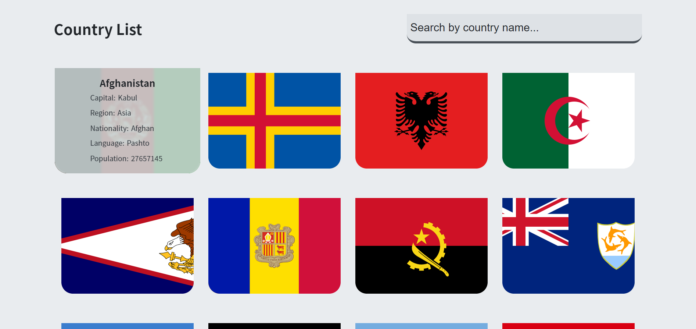
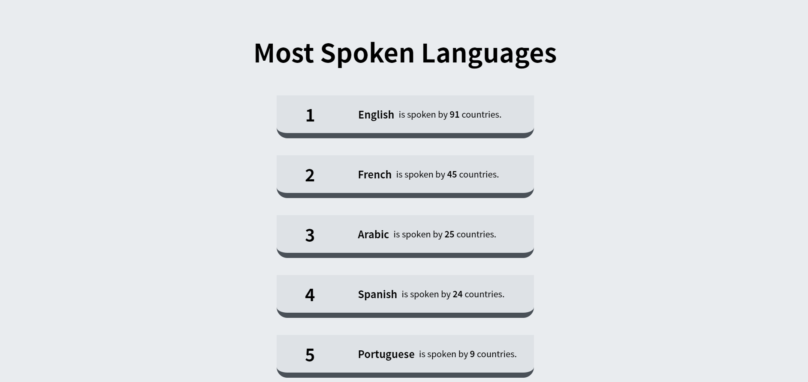

# ⚛️ Country App with ReactJS

<a href="https://react-country-app-mhmtmtlu.netlify.app/">Go to Website</a>

# 🧰 Toolbox

<ul style="list-style-type:disc">
   <li><a href="https://reactrouter.com/web/guides/quick-start">React Router</a></li>
   <li><a href="https://styled-components.com/docs">Styled Components</a></li>
   <li><a href="https://www.framer.com/docs/">Framer Motion</a></li>
   <li><a href="https://www.npmjs.com/package/axios">Axios</a></li>
   <li><a href="https://restcountries.eu/rest/v2/all">Rest Countries API</a></li>
</ul>

# 🎞 Screenshot





## Ülke Listesi / Istatistikleri Uygulaması

- Lütfen bu uygulamanızı React kullanarak yapın.
- Bu uygulamada Create-React-App kullanarak bir başlangıç yapın.

## Uygulama detayı

- Açılış sayfasında [Ülke Listesi, Istatistikler] adında iki buton olmalı. Ulke listesi ise açılışta seçili olarak gelmeli. (Tab gibi düşünebilirsiniz.)


- Ülke listesi seçili olduğu zaman ekranda API'dan dönen ülkelerin [Isim, Bayrak, Baskent, Dil] bilgilerinin yer aldığı bir kart olacak.

- Istatistikler seçili olduğu zaman ise ekranda bu ülkelerde en çok konuşulan 10 dil aşağıdaki formatta yer alacak.
    ```
    1) Dil Adı - Konusulan ulke sayisi
    ...
    10) Dil Adı - Konusulan ulke sayisi


    Orn: 
    1) English - 91
    2) French  - 45
    ```

- Olsa iyi olur: Uygulamanızi bir link üzerinden yayınlamayı  deneyin (deploy). Yayınlayabilirseniz readme dosyanıza live preview olarak o linki ekleyin. Kullanabileceğiniz örnek servisler: Vercel, Netlify (Başka yöntem kullanmakta özgürsünüz)


## API Link
https://restcountries.eu/rest/v2/all