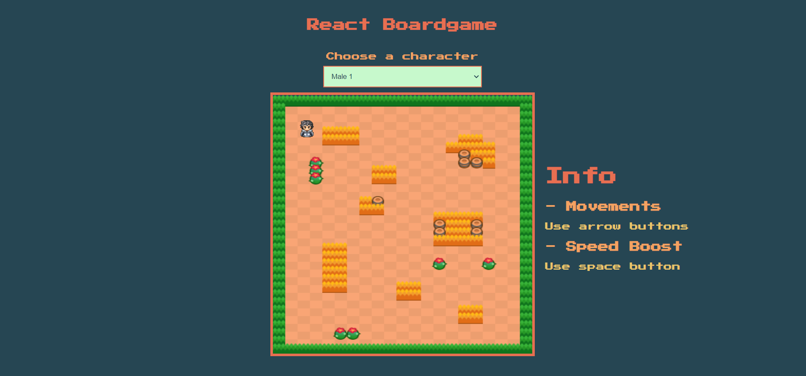
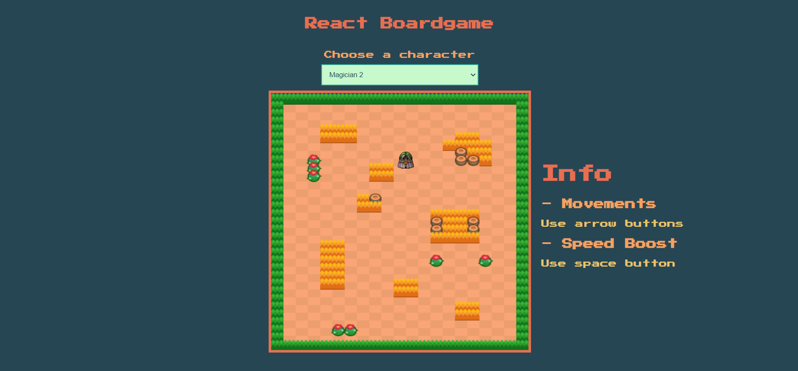

# ⚛️ Board Game with ReactJS

<a href="https://react-boardgame-mhmtmutlu.netlify.app/">Live Preview</a>

# 🧰 Toolbox

<ul style="list-style-type:disc">
   <li><a href="https://reactjs.org/docs/context.html">React Context API</a></li>
   <li><a href="https://sass-lang.com/guide">Scss</a></li>
   <li><a href="https://usehooks.com/">Custom Hooks</a></li>
</ul>

# 🎞 Screenshot

## HAFTA 4 - ÖDEV

# React mix example

- Bu proje tamamen ReactJS kullanılarak yapılacaktır.
- React'in Virtual DOM mantıgini bozmayan yardimci kutuphane kullanabilirsiniz. (Kesinlikle JQuery gibi DOM'a direk mudahale eden kutuphane kullanmak yasaktır.)

Ne istiyoruz?

- Ekranda 500px X 500px boyutunda köşe renkleri olan bir alan (oyun tahtasi) oluşturun.
- Bir karakter component'i oluşturun. Bu karakter 20px x 20px bir kare de olabilir sizin göstermek istediginiz bir image da olabilir.
- Uygulama acildiginda karakterimiz bu oyun tahtasinda yukari, asagi, sag, sol ok tuslariyla hareket edebilsin istiyoruz. 
- Space tusuna basili tutulursa karakterin hareket etme hızı iki katına çıkmalı.
- Sayfa yenilenirse karakter kaldigi yerden devam etmeli.
- Karakter oyun tahtasindan cikamamali.
- Ekranda bulunan bir dropdown ile karakter degistirilebilir. Yani birden cok karakter componenti (en az 2) yapmanizi istiyorum.

- Uygulamayı tamamen React hooks ile yapmayı deneyin. Kendi hooklarinizi yazmakta cekinmeyin.
- Olabildigince duzenli kod yazmayi deneyin. Birden cok component olusturun.
- Istediginiz bir ESLint kuralini takip edin.
- Opsiyonel olarak uygulamanızı vercel, netlify v.b bir servise deploy edin ve linki readme dosyaniza ekleyin. 
- Arkadaslarinizla discord uzerinden code-review yapin. En az 1 kere! Yazdiginiz kodlari karsilikli olarak nasil daha iyi hale getirebilirsiniz buna bakin.

Daha iyi anlasilmasi icin ornek resimler.
(Burada mario ve kare karakterleri yukari, asagi, sag, sol ok tuslariyla hareket edebiliyor. )

