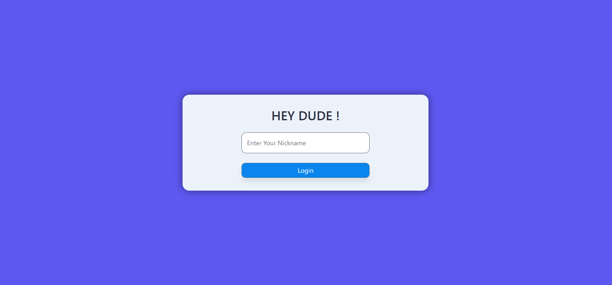
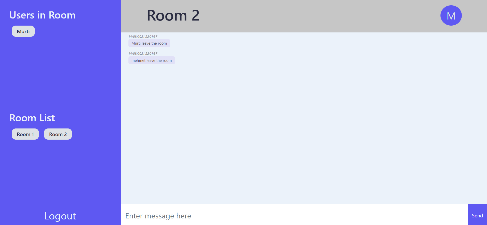

# ⚛️ Chat App with ReactJS 

I have coded a chat app by using ReactJS and Firebase with my team.

<a href="https://team-b-react-chat-app.netlify.app/login">Live Preview</a>

# 🎞 Screenshot

# 👨‍💻👩‍💻 Contributors

<ul style="list-style-type:disc">
   <li><a href="https://github.com/bstkpnr">Beste Tokpınar</a></li>
   <li><a href="https://github.com/Reyhandede">Reyhan Dede</a></li>
   <li><a href="https://github.com/ahmetkelek">Ahmet Kelek</a></li>
   <li><a href="https://github.com/alperenmehmet">Mehmet Alperen</a></li>
   <li><a href="https://github.com/codeunlu">Mustafa Ünlü</a></li>
   <li><a href="https://github.com/MhmtMutlu">Mehmet Mutlu</a></li>
</ul>

# Ödev - Chat APP

Birden çok odası bulunan, herkesin oda ekleyebildiği, herkesin anonim olarak herhangi bir odaya katılıp mesajlaşabildiği bir live chat app yapmanızı bekliyorum. Çok temelde chat appimiz üç ekrandan oluşuyor.

- [x] Ana ekran (/login) ekranı

  -> Ekranda [Kullanici Adi] inputu ve [giris yap] butonu var.

  -> Herkes istediği username ile giriş yapabilir.

  -> Sifre sormaz, kayit mantigi yoktur. Herkes hizlica giris yapip mesajlasmaya baslayabilir.

- [x] Oda Listesi (/rooms) ekrani

  -> Giris sonrasi mevcut tum odalar listelenir. [Genel, GoyGoy, Teknoloji, ...] gibi odalar oluşturabilirsiniz.

  -> Bu ekranda istenirse yeni oda eklenebilir(Ekranin en altina bir yeni oda ekle butonu / input'u eklemek kafi.)

  -> Herhangi bir odanin uzerine gelindiginde odada kac kisi oldugu yazar ve chat'e katil butonu vardir.

- [x] Chat room (/room/room-name)

  -> Odaya katildiginiz zaman sol tarafta oda listesi gorunmeye devam eder. Sag tarafta bir chat kutusu ve chat gecmisi vardir. Anlik yazilanlar chat vasitasiyla gonderilir. Diger kisilerin ekranina anlik duser. (Discord gibi dusunun)